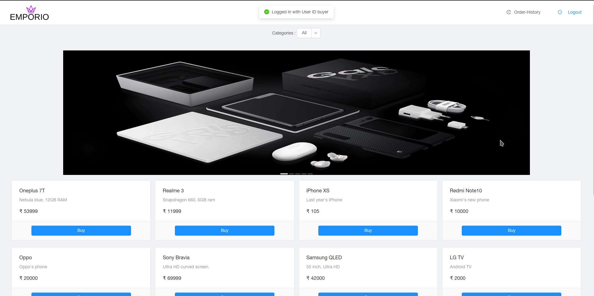
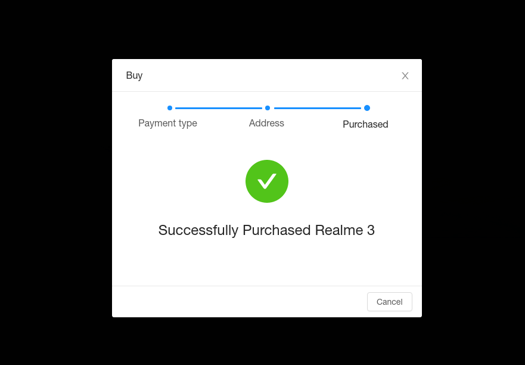
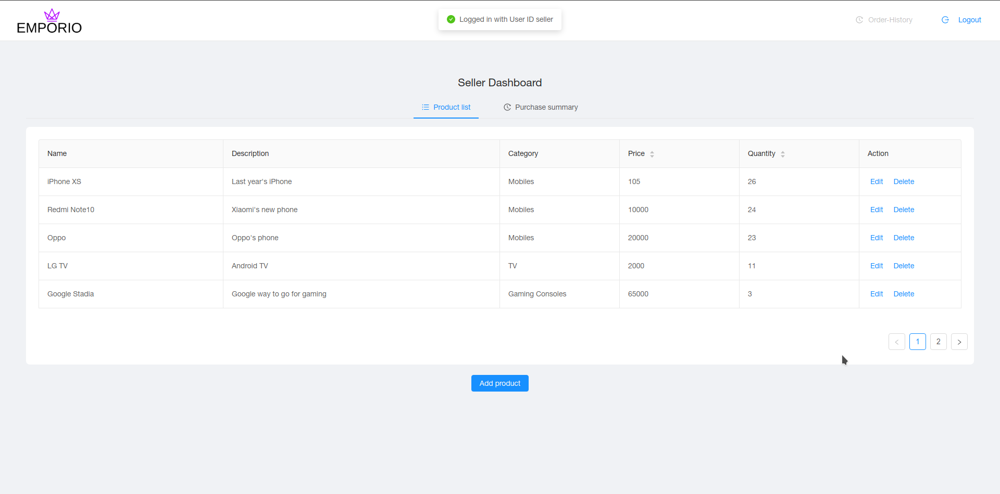
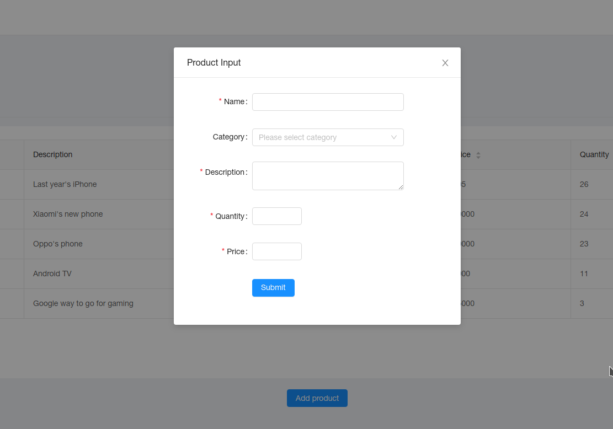
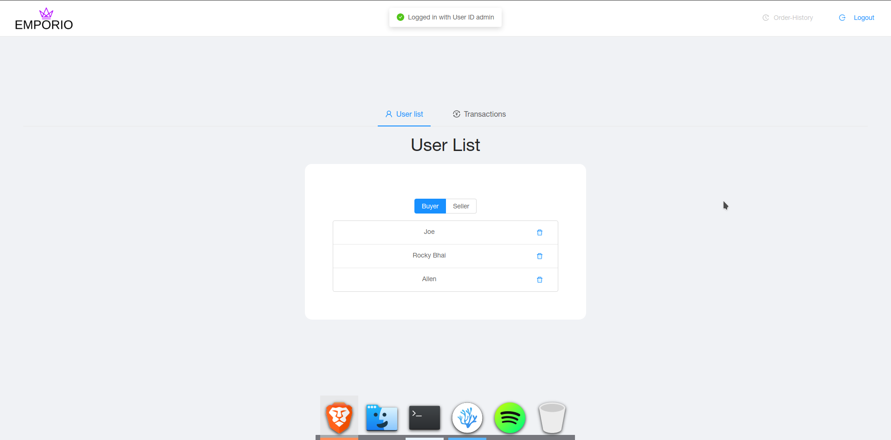
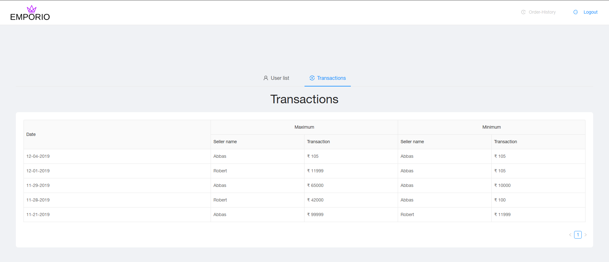

# Emporio
Emporio is a modern online shopping experience. The main objective of this project is to demonstrate the working of modern frameworks used in the development of websites. This project was the submission for VTU's 5th Semester DBMS mini-project

## Implementation details
- [React JS](https://reactjs.org) is a JS library used to build the frontend of this project
- [Ant design](https://ant.design/)  for the design language
- [Express Js](https://expressjs.com/) for middle ware
- [mysql driver](https://www.npmjs.com/package/mysql)
- [Maria DB](https://mariadb.org/) is the database used
- [bcrypt](https://www.npmjs.com/package/bcrypt) is used to hash the passwords stored

## Screenshots

### Homepage

### Buyer homepage when logged in

### Buyer on successful purchase

### Seller Dashboard

### Seller Add Product

### Admin Dashboard

### Admin Transactions View

## Credits
This project is created by Allen and Abbas